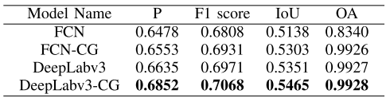

## Weekly Paper Review

My first written paper review of the year. I'm still figuring out how I want to approach this. Taking my goal of this program into consideration, I want it to be concise but highlights:

- uniqueness (paper structure, explanation, use of visualization)
- novelty (state of the art (SotA) performance, new method/technique)
- importance (ground breaking/foundational papers)

I want it to be more than just reading abstracts, it should make me remember what the research is about. 

### Scope

The scope of papers are research related to Computer Vision with Deep Learning, so I have a whole sea of papers to explore. Going into more specific, my current interest is segmentation task on aerial imagery dataset, and to be exact, the images are produced from Synthetic Aperture Radar (SAR). My estimate though is that research interest can change as time goes, so I'll probably do more reviews of foundational papers in my root research (deep learning) to strengthen my core knowledge and hopefully be a better DL engineer.

## CG-Net

I read this paper two weeks ago, and it's very close to what I want to achieve. It's an excellent piece of work, lots of visualizations, concise explanation and also a great approach to tackle challenges working with SAR images. The paper can be found in [arXiv](https://arxiv.org/abs/2011.08362). Interestingly, there's also another research named "CGNet", from 2018, but without a dash in it

### Title

CG-Net: Conditional GIS-aware Network for Individual Building Segmentation in VHR SAR Images

### Background

SAR image are indeed difficult to process even to interpret for the untrained eye. The writers state some challenges:

- Pixel values are not light intensities, but closely related to material types and structural shapes of objects. This makes it hard to differ a building from another unless they use different materials or shapes.
- Building overlaps due to layover, a phenomena in radar imaging occurred with tall objects (such as buildings), where the radar signal reaches the rooftop first before the base. This makes the return signal from the top received before the bottom, distorting the pixel order in the final image.
- Another difficulty is shadowing, since SAR sensors are side-looking, it means there won't be any return signals behind the building, leaving it as empty or dark pixels.

*Comparison of optical and SAR imagery. We can see the layover effect where the rooftops are visible earlier in SAR image compared to the optical. When I say "earlier" I meant based on the receiving time of returned signal, and in this figure, the radar's signal source is from the top of the image. We can also see shadowing effects where black pixels appear "after" the buildings*

### Dataset

Using Digital Elevation Model (DEM) and Geographic Information System (GIS) data for building height and area, they created (kinda) 3D model of each building for ground truth.

*Dataset generation workflow*

DEM contains building height. They use this to model how buildings look in SAR images, using the building's height to cast shadows, creating layover effects in the direction of the radar source. This will be the buildings' annotations and the model is expected to output a mask like this.

Using GIS data containing building areas, they generate 2 types of building footprints: complete building footprints (the edges/area surrounding a building) and sensor-visible footprint (walls visible as the effects of layover). These will be compared later on.

Both DEM and GIS data are in UTM coordinate system (crs) which are `(x,y,h)`, they convert this to match crs in SAR image `(range, azimuth)`

### The Model

- VGG-16 as feature extractor, weights are pre- trained on ImageNet
- CG-NET performs segmentation mask. The target are building masks, but not the square-like areas usually derived from their rooftops. The masks are generated from DEM that aims to simulate how tall buildings look in SAR images.
- For preprocessing: the SAR image is cropped into 256x256 resolution patches with strides of 150px (so there's some overlapping). Each patch will have: cropped SAR, footprint (*Complete Building* or *Sensor-Visible*) and ground truth masks of buildings
- Each input contains 1 SAR patch and its corresponding footprint patch.
- Loss function is `binary crossentropy`, optimizer is Netrov Adam
- Trained for 155k epochs, learning rate starts from 0.002 and drops if no improve in loss after 2 epochs. batch size of 5.

### What does it mean by GIS aware?

- A specific module performs conditional GIS-aware normalization
- The module normalizes the prediction with geometry information from individual buildings contained in GIS data. They want the model to output segmentation masks from a SAR image and take into considerations the GIS data.
- To put in perspective, a segmentation model that extracts building from normal optical aerial image has a target of building area (because that's how buildings are viewed from above, we look at it's perimeters), and this can't be boosted with GIS-aware, because the GIS data *is* the target output. In SAR images, buildings look weird making the building area hard to see (unlike nice edge of gradient difference in pixels like in optical imagery). That's why the authors switched the model's output to predict SAR-styled building masks, which are areas visible to radar sensors in the SAR image (rooftop and walls on one side of the building). These are modeled from DEM data. But they don't just throw away the GIS data, they use it to help the model get a sense of the building's perimeter, even though in a SAR image, the buildings look very different than the building areas in GIS data.

### Result

The authors compared 2 models, each with and without the CG-module. Also they compare using GIS data of *complete* or the *sensor-visible*  building footprint.

*Results using sensor-visible building footprint. The CG module is indeed an innovative solution but it only increase the model's performance by some margin in each metrics*

*Results using complete building footprint*

I did had a hard time understanding the workflow behind the CG module but I think it's a form of batch normalization applied to feature maps extracted from a convolution block. In the end I looked at the results and it did increase performance in all metrics when CG is used. A difference of `0.02` might not look significant, but in a data science competition, it's important enough to decide you win a prize or not. 

### Final Thoughts

- The structure of the paper is solid, it will easily be one of my reference paper not just for the results, but for the writing as well
- Compact explanation, packed with details. Took me 2-3 times of reading to get a good understanding, but it was really worth it
- Visualizations are intuitive, ex: in segmentation masks they used green as true positives, red as false positives, and blue as false negatives. Model architecture and dataset generation workflow is also clear, although I was confused because of the naming. Now I would totally agree on *sensor-visible* or *complete building footprint* and *building annotations*, but it's just confusing to read at first.
- They presented further application of their results, ex: simulating input errors of GIS open sourced data by creating random position errors for their GIS data and test it on the model. It turns out the model is quite robust to position errors (or in my shallow opinion, the CG module isn't just significant enough to actually be useful)

### Reference
*Sun, Y., Hua, Y., Mou, L., & Zhu, X. X. (2020). CG-Net: Conditional GIS-aware Network for Individual Building Segmentation in VHR SAR Images. arXiv preprint arXiv:2011.08362*

All figures are also cropped from the paper.